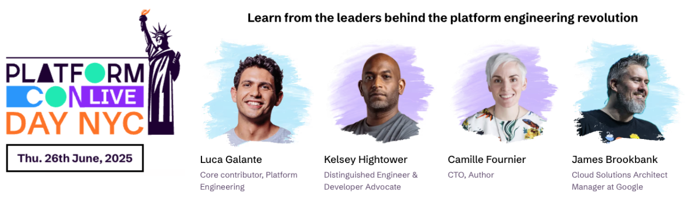

## Overview
This is a simple ADK agent that uses Gemini to generate an image description in structured format.

### Structured Output
The agent is designed to output structured data in JSON format. The expected output includes the following fields:
```python
from pydantic import BaseModel, Field

class StructuredOutput(BaseModel):
    city: str = Field(description="City where the event is taking place")
    date: str = Field(description="Date of the event")
    speakers: list[str] = Field(description="List of speakers at the event")
    event: str = Field(description="Name of the event")
    description: str = Field(description="Description of the event")
```

### Agent Configuration
The configuration includes the following parameters to enable structured output.

**When you define an output schema, you cannot use tools or agent transfers.**
```python
# 2. Define Your Agent
root_agent = Agent(
    model=model_name,
    name="Image_Description_Agent",
    instruction="You are an expert image description agent. You provide detailed descriptions of images.",
    # When you define an output schema, you cannot use tools or agent transfers.
    disallow_transfer_to_parent=True,
    disallow_transfer_to_peers=True,
    output_schema=StructuredOutput,
)
```

### Install dependencies:

```bash
python3 -m pip install google-adk
```

### Set environment variables:

```bash
export GOOGLE_GENAI_USE_VERTEXAI=TRUE
export GOOGLE_CLOUD_PROJECT=YOUR_GCP_PROJECT_ID
export GOOGLE_CLOUD_LOCATION=GCP_LOCATION
export MODEL=gemini-2.0-flash-001
```

### Run agent:

```bash
python3 agent.py
```


### Output:
```JSON
{
  "city": "NYC",
  "date": "Thu. 26th June, 2025",
  "speakers": [
    "Luca Galante",
    "Kelsey Hightower",
    "Camille Fournier",
    "James Brookbank"
  ],
  "event": "Platform Con Live",
  "description": "Learn from the leaders behind the platform engineering revolution"
}
```

### Input image:

[Event info](https://platformcon.com/live-day-nyc)